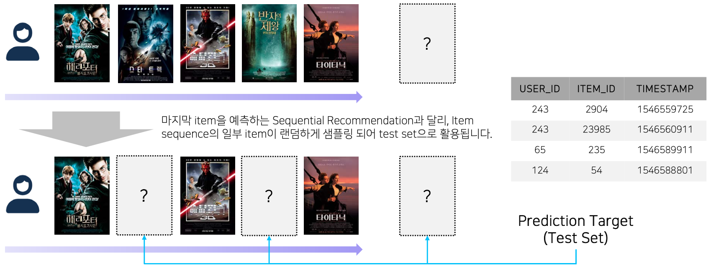
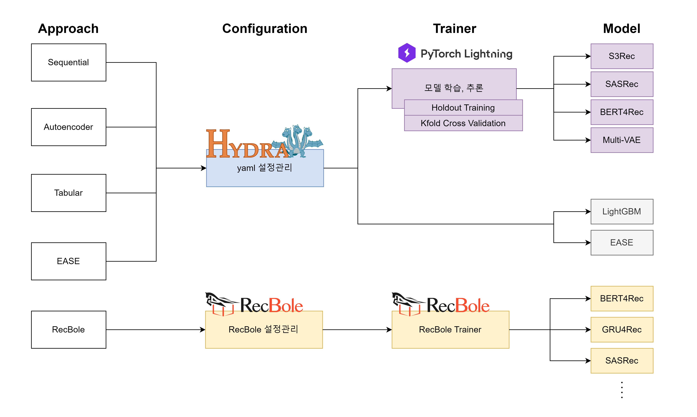

<div align="center">
  <br>
  
  <h1>Level2 Movie Recommendation</h1>
  <strong>Recsys-03 Recdol</strong>
  <br>
</div>
<br>
<p align="center">
  
  
  
  
  
  
  
  
  
  
</p>

## 개요
네이버 커넥트재단의 부스트캠프 AI Tech에서 주최한 대회로 RecSys 트랙 내부에서 진행되었습니다.
<div align="center">
  <br>
  
  <br>
  <br>
</div>

-	일반적인 영화 추천 대회의 경우 유저의 영화 시청 이력 데이터를 바탕으로 다음에 시청할 영화 및 좋아할 영화를 예측하였습니다.
-	본 대회에서는 실제와 비슷한 상황을 가정하기 위해 마지막 영화 뿐만 아니라 중간 시청 이력이 누락된 상황을 상정하였습니다.
-	또한 여러가지 영화와 관련된 Side-information이 존재하기 때문에 이것들을 효과적으로 활용하는 것이 중요합니다.

## 구조


## 활용 모델
### General Recommentation
- Multi-VAE: Variational Autoencoder 기반의 CF 모델, multinomial likelihood와 annealing기법을 사용함
- EASE: Autoencoder기반의 user-free 모델로, 희소성이 높은 데이터와 cold start problem에 강인함
- LightGBM: 트리 기반 모델로 leaf-wise 방식을 사용하여 학습속도가 빠르다는 장점을 가짐

### Sequential Recommendation
- GRU4Rec: GRU를 사용하여 item sequence의 순차적인 패턴을 학습함
- BERT4Rec: BERT를 적용한 모델로SASRec과 달리 양방향으로 학습할 수 있어 좋은 성능을 보일 것이라 기대함
- S3Rec: Self-supervised learning 을 통해 Side information과 item sequence정보를 pretrain함
- S3Rec + SASRec: S3Rec으로 pretrain된 item embedding을 초기 가중치로 SASRec을 finetune함
- S3Rec + BERT4Rec: S3Rec으로 pretrain된 item embedding을 초기 가중치로 BERT4Rec을 finetune함
- SRGNN: GNN계열의 모델로 아이템 사이의 복잡한 전환을 정확하게 표현함

## 구성원 및 역할
|  |  |  |  |  |
| :---: | :---: | :---: | :---: | :---: |
| [강찬미](https://github.com/kCMI113) | [박동연](https://github.com/DyeonPark) | [서민석](https://github.com/alstjrdlzz) | [이준영](https://github.com/2jun0) | [주혜인](https://github.com/juhyein) |
- **강찬미**: Sequential 베이스라인 구축, BERT4Rec 구현
- **박동연**: EDA 및 전처리, Tabular 베이스라인 구축, EASE 구현, Ensemble 구현
- **서민석**: EDA, Autoencoder 베이스라인 구축, Multi-VAE 구현 및 HPO
- **이준영**: Sequential 베이스라인 구축, S3Rec 구현
- **주혜인**: EDA, RecBole+Ray Tune, 베이스라인 구축

## Setting
### How to set pre-commit config

```bash
pip install pre-commit
pre-commit install
```

## Further Reading
- [랩업리포트](./docs/MovieRec_Team3_WrapUp_Report.pdf)